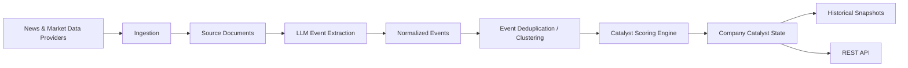
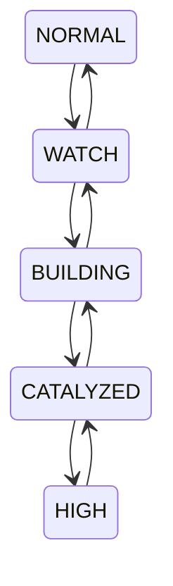
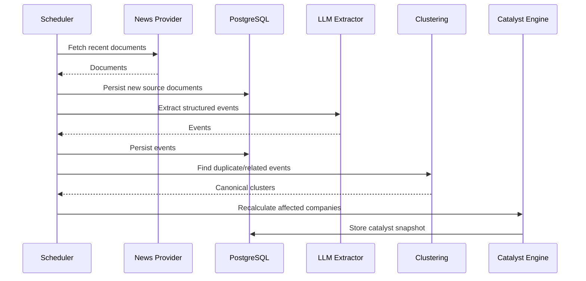

# CatalystRadar

CatalystRadar is a standalone market-intelligence service that continuously analyzes company-related information, extracts structured catalyst events, maintains a historical catalyst state for each company, and exposes companies whose catalyst profile is strengthening through a versioned REST API.

The project is designed as an independent service and is not tied to any specific trading application.

## What CatalystRadar does

CatalystRadar answers questions such as:

* Which companies are accumulating positive or negative catalysts?
* Which companies are moving from a normal state into a `WATCH`, `BUILDING`, or `CATALYZED` state?
* What events caused the catalyst score to change?
* How quickly is the catalyst profile changing?
* Which signals are independent events and which are duplicate reporting of the same underlying event?
* What did the catalyst state look like at a specific point in history?

The service focuses on structured fundamental and event-driven intelligence rather than trading decisions.

CatalystRadar does **not** generate buy/sell recommendations, entries, stops, or position sizing.

---

## Current scope — v0.1

The first version focuses on:

* US equities
* API-only access
* scheduled news ingestion
* company reference data
* structured event extraction using an LLM
* event deduplication and clustering
* deterministic catalyst scoring
* historical catalyst snapshots
* catalyst state transitions
* discovery APIs
* historical replay and evaluation support

Out of scope for v0.1:

* UI
* order execution
* portfolio management
* technical indicators
* real-time tick feeds
* social-media sentiment
* primary-source ingestion such as SEC filings and company IR feeds
* webhooks
* Kafka
* Redis
* Kubernetes
* dedicated vector databases

---

## Core architecture



The service is initially implemented as a modular monolith.

The internal architecture keeps provider integrations, extraction, scoring, persistence, and API layers separated so that they can evolve independently.

---

## Technology stack

### Application

* Kotlin
* JVM 21
* Spring Boot
* Gradle Kotlin DSL

### Persistence

* PostgreSQL
* pgvector
* Flyway

### External services

* Polygon
* Finnhub
* OpenAI API

Polygon and Finnhub are accessed through provider abstractions and must not leak into the core domain model.

### Testing

* JUnit
* Testcontainers
* WireMock
* Spring Boot Test

### Observability

* Spring Boot Actuator
* Micrometer
* OpenTelemetry-compatible instrumentation

---

## Development environment

Local infrastructure runs in Docker while the Kotlin application normally runs directly from the IDE or Gradle.

Expected development flow:

```bash
docker compose up -d
./gradlew bootRun
```

Local services:

```text
CatalystRadar API
http://localhost:8080

PostgreSQL
localhost:5432
```

Developers should not need a locally installed PostgreSQL instance.

---

## Environment variables

The exact configuration may evolve, but v0.1 is expected to use variables similar to:

```bash
DATABASE_URL=jdbc:postgresql://localhost:5432/catalyst_radar
DATABASE_USER=catalyst
DATABASE_PASSWORD=catalyst

POLYGON_API_KEY=...
FINNHUB_API_KEY=...
OPENAI_API_KEY=...

CATALYST_INGESTION_ENABLED=true
CATALYST_INGESTION_INTERVAL=PT30M
```

Secrets must never be committed to Git.

Use local environment variables or a `.env` file excluded through `.gitignore`.

---

## Domain model

The central distinction in CatalystRadar is:

```text
SourceDocument != Event
```

A news article is a source document.

A source document may describe multiple events.

Multiple documents may describe the same underlying event.

Example:

```text
Reuters article
Bloomberg article
Yahoo syndication

        ↓

GUIDANCE_RAISE
BACKLOG_GROWTH
```

Catalyst scoring is based on canonical events, not article count.

This prevents duplicated reporting from artificially increasing a company's score.

---

## Event taxonomy

v0.1 uses a controlled event taxonomy.

Top-level event families:

```text
EARNINGS
GUIDANCE
COMMERCIAL
PRODUCT_TECH
CORPORATE_ACTION
CAPITAL_ALLOCATION
ANALYST
REGULATORY
LEGAL
MANAGEMENT_OWNERSHIP
INDUSTRY_EXTERNAL
```

Examples of event types include:

```text
EARNINGS_BEAT
EARNINGS_MISS

REVENUE_BEAT
REVENUE_MISS

GUIDANCE_RAISE
GUIDANCE_CUT

BACKLOG_GROWTH
BACKLOG_DECLINE

BOOKINGS_ACCELERATION
BOOKINGS_DECELERATION

CONTRACT_WIN
CONTRACT_LOSS

LARGE_ORDER
ORDER_CANCELLATION

CUSTOMER_WIN
CUSTOMER_LOSS

DEMAND_ACCELERATION
DEMAND_DECELERATION

TAKEOVER_TARGET
ACQUISITION_ANNOUNCED

BUYBACK_ANNOUNCED

ANALYST_UPGRADE
ANALYST_DOWNGRADE

APPROVAL_GRANTED
APPROVAL_DENIED

LEGAL_WIN
LEGAL_LOSS

CEO_DEPARTURE
INSIDER_BUY

INDEX_INCLUSION
INDEX_EXCLUSION

PEER_POSITIVE_READTHROUGH
PEER_NEGATIVE_READTHROUGH

CUSTOMER_CONFIRMATION
CUSTOMER_WEAKNESS
```

---

## Event attributes

An event contains structured information beyond its type.

Conceptually:

```kotlin
data class CatalystEvent(
    val companyId: UUID,
    val type: EventType,
    val direction: Direction,

    val confidence: Double,
    val magnitude: Double?,
    val surprise: Double?,
    val materiality: Double?,

    val sourceQuality: SourceQuality,
    val expectedHorizon: EventHorizon,
    val directness: Directness,

    val scheduled: Boolean,

    val eventTimestamp: Instant,
    val discoveredAt: Instant,

    val extractorVersion: String
)
```

Important dimensions include:

* direction
* confidence
* magnitude
* surprise
* materiality
* source quality
* event horizon
* direct vs inferred event
* scheduled vs unscheduled event

---

## Catalyst score

CatalystRadar uses deterministic scoring.

The LLM extracts structured information, but it does not decide the final score.

Conceptually:

```text
EventScore =
    BaseWeight
  × Confidence
  × SourceQuality
  × Materiality
  × Surprise
  × Directness
  × Novelty
  × TimeDecay
```

Company-level scores combine effective event scores and a convergence bonus for independent event families.

Example:

```text
GUIDANCE_RAISE
+
BACKLOG_GROWTH
+
CONTRACT_WIN
+
ESTIMATE_REVISION_UP
```

is considered stronger than four articles describing the same guidance increase.

All scoring logic must be versioned.

Example:

```text
score-v1
score-v2
```

Historical snapshots retain the scoring version used to calculate them.

---

## Catalyst states

The initial state machine is:



Initial score bands:

```text
NORMAL       0–25
WATCH       25–45
BUILDING    45–65
CATALYZED   65–80
HIGH         80–100
```

Thresholds are provisional and will be calibrated using historical evaluation.

---

## Catalyst velocity

The current score alone is not sufficient.

CatalystRadar also tracks score change over time:

```text
velocity1d
velocity3d
velocity7d
```

Example:

```text
score today       = 63
score 7 days ago  = 31

velocity7d        = +32
```

A rapidly accelerating `BUILDING` company may be more relevant than a stale company with a higher absolute score.

---

## API

All public APIs are versioned.

Base path:

```text
/v1
```

Initial endpoints:

```http
GET /v1/companies/{ticker}

GET /v1/companies/{ticker}/events

GET /v1/companies/{ticker}/catalyst

GET /v1/companies/{ticker}/timeline

GET /v1/events

GET /v1/discovery/catalyzed

GET /actuator/health
```

Example discovery request:

```http
GET /v1/discovery/catalyzed
    ?state=BUILDING,CATALYZED
    &minScore=55
    &minVelocity7d=8
    &limit=50
```

Example response:

```json
{
  "asOf": "2026-09-17T00:00:00Z",
  "results": [
    {
      "ticker": "XYZ",
      "company": "Example Corp",
      "score": 71.4,
      "state": "CATALYZED",
      "velocity7d": 18.7,
      "events7d": 6,
      "confidence": 0.88
    }
  ]
}
```

---

## Provider abstraction

Third-party APIs must remain behind interfaces.

Example:

```kotlin
interface NewsProvider {
    suspend fun fetch(query: NewsQuery): List<RawArticle>
}
```

```kotlin
interface MarketDataProvider {
    suspend fun getCompany(ticker: String): CompanyReference?
}
```

```kotlin
interface EventExtractionProvider {
    suspend fun extract(
        document: SourceDocument
    ): ExtractedEvents
}
```

Initial implementations may include:

```text
PolygonNewsProvider
FinnhubNewsProvider
PolygonMarketDataProvider
OpenAiEventExtractionProvider
```

The domain layer must not contain Polygon-, Finnhub-, or OpenAI-specific models.

---

## Ingestion pipeline



The v0.1 ingestion process uses scheduled polling.

A queue is deliberately not required initially.

---

## Historical replay

Replayability is a core requirement.

Given previously stored source documents, CatalystRadar must be able to regenerate:

```text
events
event clusters
company scores
state transitions
historical snapshots
```

using a newer:

```text
taxonomy version
extractor version
scoring version
```

Historical experiments must be reproducible.

---

## Model and prompt versioning

Each LLM extraction stores information such as:

```text
provider
model
prompt_version
extractor_version
input_tokens
output_tokens
latency
estimated_cost
```

This allows:

* prompt regression testing
* cost monitoring
* historical replay
* extraction comparison
* debugging unexpected events

---

## Evaluation strategy

CatalystRadar is designed to be validated empirically.

The first benchmark focuses on liquid US stocks with large subsequent price movements.

Example positive cases:

```text
forward return >= +10%
over 1, 3, 5 or 10 sessions
```

Candidate restrictions may include:

```text
market cap > $2B
price > $5
minimum average daily liquidity
```

For each target event date `T0`, historical catalyst state is evaluated using only data available at:

```text
T-10
T-7
T-5
T-3
T-1
```

Matched control companies are required to measure false positives and avoid hindsight bias.

Key metrics include:

```text
precision
recall
false-positive rate
lead time
forward return
maximum favorable excursion
maximum adverse excursion
coverage
```

The central hypothesis is:

> Companies entering BUILDING or CATALYZED state should exhibit a meaningfully higher probability of subsequent large moves than matched control companies.

---

## Testing

The project should include:

### Unit tests

For:

* scoring
* time decay
* convergence bonus
* state transitions
* provider normalization
* event clustering rules

### Integration tests

Using Testcontainers for PostgreSQL.

### Provider tests

External providers should be tested through mocks or WireMock rather than live API calls during normal CI.

### Golden extraction dataset

A version-controlled set of representative documents should test LLM extraction behavior.

Example expected result:

```json
{
  "eventType": "GUIDANCE_RAISE",
  "direction": "POSITIVE",
  "company": "DELL"
}
```

Changes to prompts or extraction models should be measurable against this dataset.

---

## Principles

CatalystRadar follows a few core principles.

### Deterministic scoring

LLMs classify and extract.

Application code scores.

### Explainability

Every catalyst score must be traceable back to the events that created it.

### Point-in-time correctness

Historical state must only depend on information available at that point in time.

### Provider independence

External APIs are adapters, not domain dependencies.

### Replayability

Stored source data should allow the intelligence pipeline to be recomputed.

### Minimal infrastructure

Do not introduce distributed infrastructure before there is a demonstrated need for it.

---

## Roadmap

### v0.1

* US equities
* Polygon/Finnhub ingestion
* OpenAI event extraction
* taxonomy-v1
* event clustering
* score-v1
* catalyst snapshots
* REST API
* discovery API
* historical replay foundation

### v0.2

Potential additions:

* SEC filings
* investor-relations feeds
* direct company sources
* future catalyst calendar
* company relationship graph
* indirect read-through signals
* webhook notifications

### v0.3

Potential additions:

* calibrated CatalystGap
* price reaction modeling
* richer historical backtesting
* multiple news providers
* score calibration based on observed forward returns

---

## Project status

CatalystRadar is currently in the initial implementation phase.

Architecture, initial taxonomy, domain boundaries, scoring model, and v0.1 scope have been defined.

The immediate objective is to implement a complete vertical slice:

```text
news ingestion
    ↓
event extraction
    ↓
event persistence
    ↓
deduplication
    ↓
catalyst scoring
    ↓
historical snapshot
    ↓
discovery API
```

The first milestone is successful when a developer can ingest real news for a defined US company universe and query CatalystRadar to understand which companies are entering a stronger catalyst state and why.
