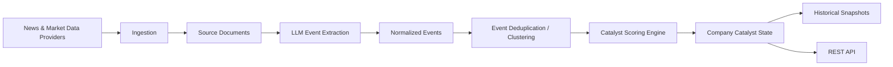
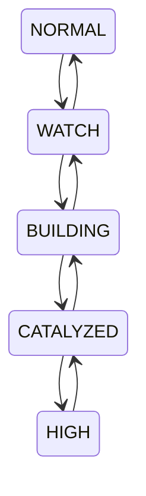
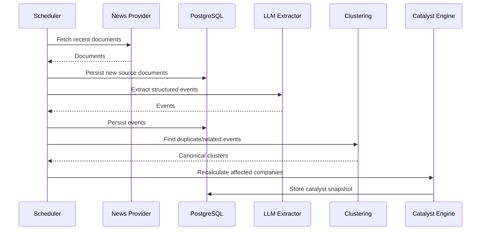

# CatalystRadar

CatalystRadar is a standalone market-intelligence service that continuously analyzes company-related information, extracts structured catalyst events, maintains a historical catalyst state for each company, and exposes companies whose catalyst profile is strengthening through a versioned REST API.

The project is designed as an independent service and is not tied to any specific trading application.

## POC status

This repository contains a working, single-process POC rather than a finished
production market-data platform. It can persist provider documents, keep a
durable per-document processing record, extract evidence-backed events, group
duplicate reporting into canonical events, calculate/snapshot catalyst state,
and expose the resulting intelligence through the REST API.

The POC also includes bounded retries, an authenticated full-pipeline trigger,
daily score-decay snapshots, and cutoff-safe replay from durable source
documents. Its fixture-based end-to-end test exercises the main
document-to-discovery path without live Polygon, Finnhub, or OpenAI credentials.

Important limits are intentional:

* Run one application instance. Scheduler guards are in-process and do not
  coordinate multiple deployments.
* Use a small configured universe. Large-universe throughput and calibration
  are not POC exit criteria.
* Real ingestion requires provider credentials supplied at runtime; no sample
  secret in this repository is valid for production.
* Scores use provisional `score-v1` rules. Benchmarking reports data quality
  explicitly but does not calibrate the model.

## What CatalystRadar does

CatalystRadar answers questions such as:

* Which companies are accumulating positive or negative catalysts?
* Which companies are moving from a normal state into a `WATCH`, `BUILDING`, or `CATALYZED` state?
* What events caused the catalyst score to change?
* How quickly is the catalyst profile changing?
* Which signals are independent events and which are duplicate reporting of the same underlying event?
* What did the catalyst state look like at a specific point in history?

The service focuses on structured fundamental and event-driven intelligence rather than trading decisions.

CatalystRadar does **not** generate buy/sell recommendations, entries, stops, or position sizing.

---

## Current scope — v0.1

The first version focuses on:

* US equities
* API-only access
* scheduled news ingestion
* company reference data
* structured event extraction using an LLM
* event deduplication and clustering
* deterministic catalyst scoring
* historical catalyst snapshots
* catalyst state transitions
* discovery APIs
* historical replay and evaluation support

Out of scope for v0.1:

* UI
* order execution
* portfolio management
* technical indicators
* real-time tick feeds
* social-media sentiment
* primary-source ingestion such as SEC filings and company IR feeds
* webhooks
* Kafka
* Redis
* Kubernetes
* dedicated vector databases

---

## Core architecture


```mermaid
flowchart LR
    A[News & Market Data Providers] --> B[Ingestion]
    B --> C[Source Documents]
    C --> D[LLM Event Extraction]
    D --> E[Normalized Events]
    E --> F[Event Deduplication / Clustering]
    F --> G[Catalyst Scoring Engine]
    G --> H[Company Catalyst State]
    H --> I[Historical Snapshots]
    H --> J[REST API]
```

The service is initially implemented as a modular monolith.

The internal architecture keeps provider integrations, extraction, scoring, persistence, and API layers separated so that they can evolve independently.

---

## Technology stack

### Application

* Kotlin
* JVM 21
* Spring Boot
* Gradle Kotlin DSL

### Persistence

* PostgreSQL
* pgvector
* Flyway

### External services

* Polygon
* Finnhub
* OpenAI API

Polygon and Finnhub are accessed through provider abstractions and must not leak into the core domain model.

### Testing

* JUnit
* Testcontainers
* WireMock
* Spring Boot Test

### Observability

* Spring Boot Actuator
* Micrometer
* OpenTelemetry-compatible instrumentation

---

## Run the POC

Local infrastructure runs in Docker while the Kotlin application runs from
Gradle or an IDE. Prerequisites are JDK 21 and Docker Desktop; Docker is also
required for the Testcontainers integration tests.

### Configure it safely

Start PostgreSQL + pgvector with:

```bash
docker compose up -d
```

Flyway applies V1 and the additive V2 migration automatically at application
startup. The local profile seeds the small reference universe, but schedulers
remain disabled unless explicitly enabled.

Use environment variables or a Git-ignored `.env` file for configuration.
Never commit a real key, token, or database password.

| Purpose | Environment variable |
| --- | --- |
| PostgreSQL connection | `CATALYST_DB_URL`, `CATALYST_DB_USER`, `CATALYST_DB_PASSWORD` |
| Internal-operation key | `CATALYST_INTERNAL_ADMIN_KEY` |
| Public API-key enforcement | `CATALYST_API_AUTH_ENABLED` |
| News providers | `POLYGON_API_KEY`, `FINNHUB_API_KEY` |
| Extraction/embeddings | `OPENAI_API_KEY`, `CATALYST_OPENAI_EXTRACTION_MODEL` |
| Full-pipeline scheduler | `CATALYST_INGESTION_ENABLED`, `CATALYST_INGESTION_INTERVAL` |
| Processing safety | `CATALYST_PIPELINE_BATCH_SIZE`, `CATALYST_PIPELINE_MAX_ATTEMPTS`, `CATALYST_PIPELINE_RETRY_DELAY` |
| Daily decay snapshots | `CATALYST_SNAPSHOTS_ENABLED`, `CATALYST_SNAPSHOTS_INTERVAL` |

On Windows PowerShell, for example:

```powershell
$env:SPRING_PROFILES_ACTIVE = "local"
$env:CATALYST_INTERNAL_ADMIN_KEY = "choose-a-local-admin-key"
.\gradlew.bat bootRun
```

On macOS/Linux:

```bash
SPRING_PROFILES_ACTIVE=local CATALYST_INTERNAL_ADMIN_KEY=choose-a-local-admin-key ./gradlew bootRun
```

Local endpoints are:

```text
CatalystRadar API   http://localhost:8080
OpenAPI             http://localhost:8080/v3/api-docs
Swagger UI          http://localhost:8080/swagger-ui.html
Health              http://localhost:8080/actuator/health
PostgreSQL          localhost:5432
```

### Five-minute fixture demo

This is the fastest proof that the POC works and requires no provider account.
It starts its own PostgreSQL Testcontainer, uses WireMock news fixtures, and
stubs the extraction/embedding boundaries:

```powershell
.\gradlew.bat test --tests "com.catalystradar.e2e.CatalystPipelineE2ETest" --no-daemon
```

The scenario proves a document becomes an evidence-backed event, a canonical
cluster, a catalyst snapshot, and a discovery result. Run the complete suite
before changing the POC:

```powershell
.\gradlew.bat clean test --no-daemon
```

The suite covers the POC acceptance path without calling live providers:

| Scenario | Automated evidence |
| --- | --- |
| Full document-to-discovery flow | `CatalystPipelineE2ETest` with WireMock and stubbed LLM boundaries |
| Scheduled execution | `IngestionSchedulerTest` calls `PipelineService` |
| Retry and idempotency | `PipelineServiceTest` retries a transient extraction failure without re-ingesting or duplicating an event |
| Extraction trust boundary | `EventNormalizationServiceTest` rejects out-of-scope and future-dated candidates |
| Canonical clustering | `EventClusteringServiceTest` keeps distinct evidence separate and syndication together |
| Daily decay | `DailySnapshotServiceTest` writes a fresher, lower decayed score for an active company |
| Point-in-time replay | `ReplayServiceTest` excludes future documents/live clusters and accepts a newly relevant linked document |
| Key issuance safety | `InternalControllersTest` asserts `Cache-Control: no-store` on raw-key issuance |

### Run real ingestion and inspect results

With Polygon/Finnhub/OpenAI keys supplied at runtime, trigger the same complete
pipeline used by the ingestion scheduler:

```bash
curl -X POST http://localhost:8080/internal/ingestion/runs \
  -H "X-Admin-Key: $CATALYST_INTERNAL_ADMIN_KEY"
```

Then query the results:

```bash
curl http://localhost:8080/v1/companies/DELL/catalyst
curl "http://localhost:8080/v1/discovery/catalyzed?minScore=45&limit=20"
```

All `/internal/*` routes require `X-Admin-Key`. The operational endpoints are:

```text
POST /internal/ingestion/runs      run the full ingest-to-snapshot pipeline
POST /internal/replays             recompute one company at a historical cutoff
POST /internal/api-clients         issue a public API key
```

Replay accepts only a ticker and a cutoff, never raw source content:

```bash
curl -X POST http://localhost:8080/internal/replays \
  -H "Content-Type: application/json" \
  -H "X-Admin-Key: $CATALYST_INTERNAL_ADMIN_KEY" \
  -d '{"ticker":"DELL","cutoff":"2026-09-16T10:00:00Z"}'
```

Create a public API key with an internal operation, copy `rawKey` immediately,
and store it in a secret manager. The response has `Cache-Control: no-store`;
only the key hash persists. Enable `CATALYST_API_AUTH_ENABLED=true` to enforce
the key on `/v1/*` requests, then send it as `Authorization: Bearer <rawKey>`.

### Scheduler and migration notes

`catalyst.ingestion.enabled` and `catalyst.snapshots.enabled` both default to
`false`. Leave them disabled for fixture-based tests. Enable them only for one
application process: the pipeline's and daily snapshot task's overlap guards
are intentionally in-memory for this POC. The daily task performs local
recalculation only; it makes no provider or LLM call.

V2 is additive and safely applies after V1. It backfills document/company
links derivable from existing events. A legacy source document with neither an
event nor a resolvable company link cannot be made replayable automatically;
start from a fresh POC database or re-ingest that material.

### Observability

`/actuator/health` is public for deployment checks and does not reveal health
details. The Micrometer registry records bounded-cardinality pipeline,
document-processing, retry, daily-snapshot, replay, provider, and LLM metrics.
No metric tags include a ticker, company ID, document body, prompt, or secret.
Connect the registry to the deployment's chosen monitoring backend rather than
logging raw provider payloads.

---

## Domain model

The central distinction in CatalystRadar is:

```text
SourceDocument != Event
```

A news article is a source document.

A source document may describe multiple events.

Multiple documents may describe the same underlying event.

Example:

```text
Reuters article
Bloomberg article
Yahoo syndication

        ↓

GUIDANCE_RAISE
BACKLOG_GROWTH
```

Catalyst scoring is based on canonical events, not article count.

This prevents duplicated reporting from artificially increasing a company's score.

---

## Event taxonomy

v0.1 uses a controlled event taxonomy.

Top-level event families:

```text
EARNINGS
GUIDANCE
COMMERCIAL
PRODUCT_TECH
CORPORATE_ACTION
CAPITAL_ALLOCATION
ANALYST
REGULATORY
LEGAL
MANAGEMENT_OWNERSHIP
INDUSTRY_EXTERNAL
```

Examples of event types include:

```text
EARNINGS_BEAT
EARNINGS_MISS

REVENUE_BEAT
REVENUE_MISS

GUIDANCE_RAISE
GUIDANCE_CUT

BACKLOG_GROWTH
BACKLOG_DECLINE

BOOKINGS_ACCELERATION
BOOKINGS_DECELERATION

CONTRACT_WIN
CONTRACT_LOSS

LARGE_ORDER
ORDER_CANCELLATION

CUSTOMER_WIN
CUSTOMER_LOSS

DEMAND_ACCELERATION
DEMAND_DECELERATION

TAKEOVER_TARGET
ACQUISITION_ANNOUNCED

BUYBACK_ANNOUNCED

ANALYST_UPGRADE
ANALYST_DOWNGRADE

APPROVAL_GRANTED
APPROVAL_DENIED

LEGAL_WIN
LEGAL_LOSS

CEO_DEPARTURE
INSIDER_BUY

INDEX_INCLUSION
INDEX_EXCLUSION

PEER_POSITIVE_READTHROUGH
PEER_NEGATIVE_READTHROUGH

CUSTOMER_CONFIRMATION
CUSTOMER_WEAKNESS
```

---

## Event attributes

An event contains structured information beyond its type.

Conceptually:

```kotlin
data class CatalystEvent(
    val companyId: UUID,
    val type: EventType,
    val direction: Direction,

    val confidence: Double,
    val magnitude: Double?,
    val surprise: Double?,
    val materiality: Double?,

    val sourceQuality: SourceQuality,
    val expectedHorizon: EventHorizon,
    val directness: Directness,

    val scheduled: Boolean,

    val eventTimestamp: Instant,
    val discoveredAt: Instant,

    val extractorVersion: String
)
```

Important dimensions include:

* direction
* confidence
* magnitude
* surprise
* materiality
* source quality
* event horizon
* direct vs inferred event
* scheduled vs unscheduled event

---

## Catalyst score

CatalystRadar uses deterministic scoring.

The LLM extracts structured information, but it does not decide the final score.

Conceptually:

```text
EventScore =
    BaseWeight
  × Confidence
  × SourceQuality
  × Materiality
  × Surprise
  × Directness
  × Novelty
  × TimeDecay
```

Company-level scores combine effective event scores and a convergence bonus for independent event families.

Example:

```text
GUIDANCE_RAISE
+
BACKLOG_GROWTH
+
CONTRACT_WIN
+
ESTIMATE_REVISION_UP
```

is considered stronger than four articles describing the same guidance increase.

All scoring logic must be versioned.

Example:

```text
score-v1
score-v2
```

Historical snapshots retain the scoring version used to calculate them.

---

## Catalyst states

The initial state machine is:


```mermaid
stateDiagram-v2
    NORMAL --> WATCH
    WATCH --> BUILDING
    BUILDING --> CATALYZED
    CATALYZED --> HIGH

    HIGH --> CATALYZED
    CATALYZED --> BUILDING
    BUILDING --> WATCH
    WATCH --> NORMAL
```

Initial score bands:

```text
NORMAL       0–25
WATCH       25–45
BUILDING    45–65
CATALYZED   65–80
HIGH         80–100
```

Thresholds are provisional and will be calibrated using historical evaluation.

---

## Catalyst velocity

The current score alone is not sufficient.

CatalystRadar also tracks score change over time:

```text
velocity1d
velocity3d
velocity7d
```

Example:

```text
score today       = 63
score 7 days ago  = 31

velocity7d        = +32
```

A rapidly accelerating `BUILDING` company may be more relevant than a stale company with a higher absolute score.

---

## API

All public APIs are versioned.

Base path:

```text
/v1
```

Initial endpoints:

```http
GET /v1/companies/{ticker}

GET /v1/companies/{ticker}/events

GET /v1/companies/{ticker}/catalyst

GET /v1/companies/{ticker}/timeline

GET /v1/events

GET /v1/discovery/catalyzed

GET /actuator/health
```

Example discovery request:

```http
GET /v1/discovery/catalyzed
    ?state=BUILDING,CATALYZED
    &minScore=55
    &minVelocity7d=8
    &limit=50
```

Example response:

```json
{
  "asOf": "2026-09-17T00:00:00Z",
  "results": [
    {
      "ticker": "XYZ",
      "company": "Example Corp",
      "score": 71.4,
      "state": "CATALYZED",
      "velocity7d": 18.7,
      "events7d": 6,
      "confidence": 0.88
    }
  ]
}
```

---

## Provider abstraction

Third-party APIs must remain behind interfaces.

Example:

```kotlin
interface NewsProvider {
    suspend fun fetch(query: NewsQuery): List<RawArticle>
}
```

```kotlin
interface MarketDataProvider {
    suspend fun getCompany(ticker: String): CompanyReference?
}
```

```kotlin
interface EventExtractionProvider {
    suspend fun extract(
        document: SourceDocument
    ): ExtractedEvents
}
```

Initial implementations may include:

```text
PolygonNewsProvider
FinnhubNewsProvider
PolygonMarketDataProvider
OpenAiEventExtractionProvider
```

The domain layer must not contain Polygon-, Finnhub-, or OpenAI-specific models.

---

## Ingestion pipeline


```mermaid
sequenceDiagram
    participant S as Scheduler
    participant P as News Provider
    participant DB as PostgreSQL
    participant L as LLM Extractor
    participant C as Clustering
    participant E as Catalyst Engine

    S->>P: Fetch recent documents
    P-->>S: Documents

    S->>DB: Persist new source documents

    S->>L: Extract structured events
    L-->>S: Events

    S->>DB: Persist events

    S->>C: Find duplicate/related events
    C-->>S: Canonical clusters

    S->>E: Recalculate affected companies
    E->>DB: Store catalyst snapshot
```

The v0.1 ingestion process uses scheduled polling backed by a durable
PostgreSQL processing record for retries. A separate message broker is
deliberately not required for the POC.

---

## Historical replay

Replayability is a core requirement. For the supported v0.1 artifact versions,
replay selects only company-linked source documents discovered by the requested
cutoff, re-extracts them, and rebuilds temporary canonical clusters without
reading live events or live cluster IDs.

That produces a non-persistent historical result with:

```text
validated replay candidates
temporary canonical clusters
company score and state
velocity calculated from cutoff-bounded snapshots
```

Unsupported version changes fail fast. A future taxonomy, extractor, or score
version requires an explicit versioned implementation and regression data;
replay does not silently mix artifact versions.

---

## Model and prompt versioning

Each LLM extraction stores information such as:

```text
provider
model
prompt_version
extractor_version
input_tokens
output_tokens
latency
estimated_cost
```

This allows:

* prompt regression testing
* cost monitoring
* historical replay
* extraction comparison
* debugging unexpected events

---

## Evaluation strategy

CatalystRadar is designed to be validated empirically.

The first benchmark focuses on liquid US stocks with large subsequent price movements.

Example positive cases:

```text
forward return >= +10%
over 1, 3, 5 or 10 sessions
```

Candidate restrictions may include:

```text
market cap > $2B
price > $5
minimum average daily liquidity
```

For each target event date `T0`, historical catalyst state is evaluated using only data available at:

```text
T-10
T-7
T-5
T-3
T-1
```

Matched control companies are required to measure false positives and avoid hindsight bias.

Key metrics include:

```text
precision
recall
false-positive rate
lead time
forward return
maximum favorable excursion
maximum adverse excursion
coverage
```

The central hypothesis is:

> Companies entering BUILDING or CATALYZED state should exhibit a meaningfully higher probability of subsequent large moves than matched control companies.

---

## Testing

The project should include:

### Unit tests

For:

* scoring
* time decay
* convergence bonus
* state transitions
* provider normalization
* event clustering rules

### Integration tests

Using Testcontainers for PostgreSQL.

### Provider tests

External providers should be tested through mocks or WireMock rather than live API calls during normal CI.

### Golden extraction dataset

A version-controlled set of representative documents should test LLM extraction behavior.

Example expected result:

```json
{
  "eventType": "GUIDANCE_RAISE",
  "direction": "POSITIVE",
  "company": "DELL"
}
```

Changes to prompts or extraction models should be measurable against this dataset.

---

## Principles

CatalystRadar follows a few core principles.

### Deterministic scoring

LLMs classify and extract.

Application code scores.

### Explainability

Every catalyst score must be traceable back to the events that created it.

### Point-in-time correctness

Historical state must only depend on information available at that point in time.

### Provider independence

External APIs are adapters, not domain dependencies.

### Replayability

Stored source data should allow the intelligence pipeline to be recomputed.

### Minimal infrastructure

Do not introduce distributed infrastructure before there is a demonstrated need for it.

---

## Roadmap

### v0.1

* US equities
* Polygon/Finnhub ingestion
* OpenAI event extraction
* taxonomy-v1
* event clustering
* score-v1
* catalyst snapshots
* REST API
* discovery API
* historical replay foundation

### v0.2

Potential additions:

* SEC filings
* investor-relations feeds
* direct company sources
* future catalyst calendar
* company relationship graph
* indirect read-through signals
* webhook notifications

### v0.3

Potential additions:

* calibrated CatalystGap
* price reaction modeling
* richer historical backtesting
* multiple news providers
* score calibration based on observed forward returns

---

## Project status and deliberate deferrals

The POC's vertical slice is implemented and verified through automated fixtures:

```text
provider fixture or live provider
    ↓
durable source document + company link + processing state
    ↓
validated evidence-backed event
    ↓
canonical event cluster
    ↓
score/state snapshot and discovery API
    ↓
cutoff-safe replay without persistent side effects
```

Deliberately deferred are multi-instance scheduling/leases, UI and trading
features, social/SEC/IR ingestion, webhooks, distributed infrastructure,
large-universe tuning, broad historical backfills, company aliases, and score
calibration. `score-v1` remains code-defined while benchmark reports are used
to make future calibration work visible rather than pretending missing market
data is a valid result.
