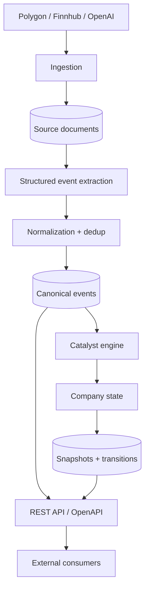
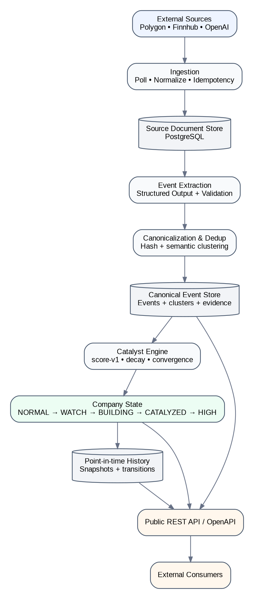
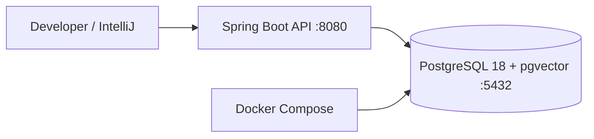
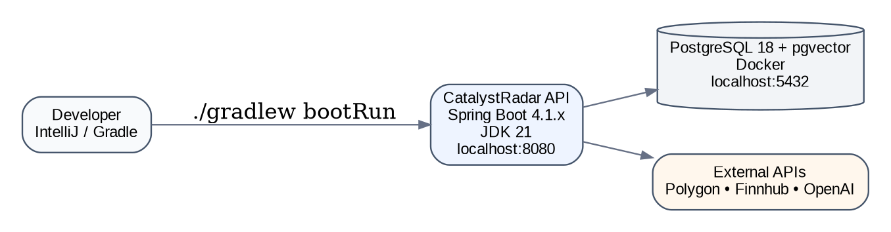
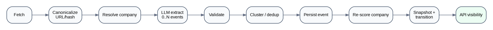
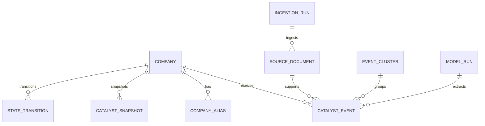
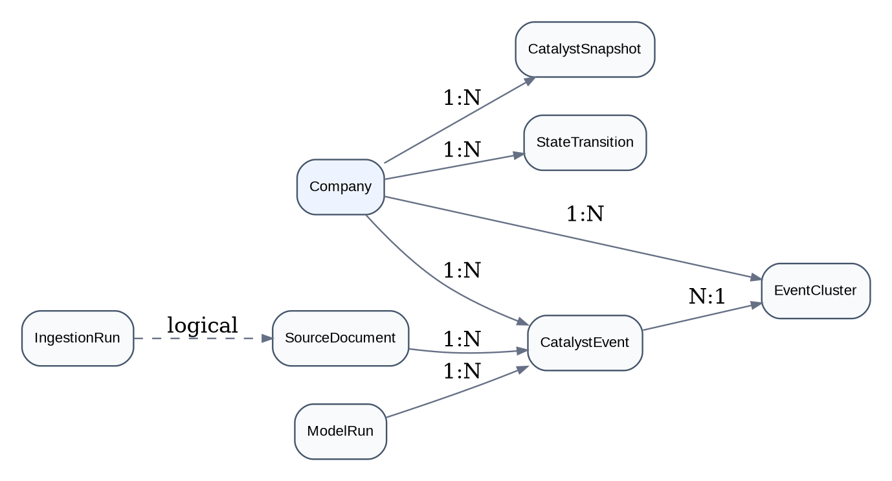
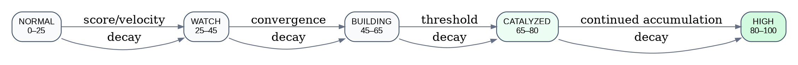

# CatalystRadar — Architecture & Product Design Specification

_Status: design baseline — September 2026_

> **Decision baseline:**CatalystRadar is a standalone product. v0.1 is API-only, US-equities-first, Kotlin/Spring Boot, and deliberately excludes any dependency on downstream trading applications.

# 1. Purpose

CatalystRadar continuously ingests company-related information, converts unstructured source material into normalized catalyst events, maintains a point-in-time catalyst state for each company, and exposes discovery and history through a stable REST API.

The product answers a narrow question: which companies are accumulating independent, material catalysts, and how quickly is that catalyst profile changing? It does not make trading decisions.

# 2. Product boundaries

| **In scope**                           | **Out of scope for v0.1**                |
|----------------------------------------|------------------------------------------|
| US listed equities                     | UI / dashboard                           |
| News ingestion and company resolution  | Order execution or portfolio management  |
| Structured event extraction            | Technical indicators / trade setup logic |
| Deduplication and event clustering     | Primary-source SEC/IR ingestion (v0.2)   |
| Deterministic scoring and history      | Cross-company relationship graph (v0.2+) |
| Public REST API + OpenAPI              | Kafka/Kubernetes/dedicated vector DB     |
| Historical replay and evaluation hooks | Social sentiment / Reddit / options flow |

# 3. High-level architecture





# 4. Technology decisions

| **Area**         | **Decision**                | **Rationale**                                                                                                  |
|------------------|-----------------------------|----------------------------------------------------------------------------------------------------------------|
| Language/runtime | Kotlin on JDK 21            | Strong JVM ecosystem, concise domain modeling, coroutine support.                                              |
| Framework        | Spring Boot 4.1.x           | Current stable line; mature Kotlin support, configuration, validation, security, observability and scheduling. |
| Build            | Gradle Kotlin DSL           | Native fit for Kotlin and reproducible dependency management.                                                  |
| Persistence      | PostgreSQL 18 + pgvector    | One operational datastore for relational state and semantic vectors.                                           |
| Migrations       | Flyway                      | Explicit, replayable schema evolution.                                                                         |
| Local infra      | Docker Compose              | Only infrastructure runs in containers; app runs from IntelliJ/Gradle for fast development.                    |
| LLM              | OpenAI via provider adapter | Structured extraction behind a replaceable port; never responsible for numeric score/state.                    |
| News/data        | Polygon + Finnhub adapters  | Existing keys; provider-neutral normalized domain model.                                                       |
| UI               | None in v0.1                | Focus on API and validating the signal model.                                                                  |
| Queue/cache      | None initially              | Avoid Redis/Kafka until a concrete need appears.                                                               |

Spring Boot 4.1.1 is the current stable release at the time of this design; Spring Boot 4 uses Kotlin 2.2.x as its Kotlin baseline. Versions should still be pinned in the build rather than resolved dynamically.

# 5. Local development topology





```bash
docker compose up -d
./gradlew bootRun

# expected
# API:      http://localhost:8080
# OpenAPI:  http://localhost:8080/v3/api-docs
# Swagger:  http://localhost:8080/swagger-ui.html
# Postgres: localhost:5432
```

The first compose file should contain PostgreSQL with pgvector only. Redis is intentionally excluded from v0.1. Testcontainers provides isolated PostgreSQL integration tests in CI and locally.

# 6. Provider strategy

Provider details are adapters, not domain concepts. A provider may be enabled or disabled by configuration without changing event/scoring code.

| **Capability**             | **v0.1 choice**                             | **Notes**                                                                                |
|----------------------------|---------------------------------------------|------------------------------------------------------------------------------------------|
| Company/ticker reference   | Polygon primary                             | Seed and refresh the supported US equity universe; persist normalized company metadata.  |
| Company/news discovery     | Polygon primary; Finnhub secondary/fallback | Normalize both to SourceDocument; do not persist provider DTOs outside raw_payload.      |
| Daily market prices        | Polygon                                     | Used for benchmark/forward-return evaluation; not part of catalyst score-v1.             |
| Earnings/calendar metadata | Finnhub optional                            | Useful context, but no primary-source ingestion until v0.2.                              |
| Event extraction           | OpenAI                                      | Use Structured Outputs with strict JSON Schema and application-side semantic validation. |
| Embeddings                 | OpenAI text-embedding-3-small               | Use for clustering/deduplication. Keep the embedding adapter replaceable.                |

| **Provider rule** No Polygon/Finnhub/OpenAI DTO, identifier, enum, or exception type may leak into the domain layer. Raw provider payloads may be retained for audit/debugging. |
|---------------------------------------------------------------------------------------------------------------------------------------------------------------------------------|

# 7. Processing pipeline

```mermaid
flowchart LR
    A[Fetch documents] --> B[Normalize + hash]
    B --> C[Resolve companies]
    C --> D[LLM extraction]
    D --> E[Validate events]
    E --> F[Cluster / deduplicate]
    F --> G[Persist canonical events]
    G --> H[Recompute score/state]
    H --> I[Snapshot + transition]
    I --> J[REST discovery/API]
```





1.  Fetch new documents using a provider-specific cursor/window.

2.  Canonicalize URL/content and reject exact duplicates using a stable SHA-256 content hash.

3.  Resolve mentioned symbols/aliases against the supported company universe.

4.  Call the extraction provider only for relevant, unresolved documents.

5.  Validate Structured Output values, evidence and enum constraints in Kotlin.

6.  Cluster semantically equivalent events by company, event type, time window and embedding similarity.

7.  Persist the canonical event plus evidence/provenance.

8.  Recompute the affected company score and state deterministically.

9.  Persist point-in-time snapshot and any state transition.

10. Expose updated state through API queries.

# 8. Domain model





A SourceDocument is evidence; it is not itself a catalyst. One document can produce multiple events, and multiple documents can support the same canonical event cluster. Catalyst scores are computed from canonical events rather than article counts.

| **Entity**       | **Responsibility**                                                       |
|------------------|--------------------------------------------------------------------------|
| Company          | Canonical US-listed company identity and aliases.                        |
| SourceDocument   | Normalized source material and raw provider provenance.                  |
| CatalystEvent    | A structured, evidence-linked event extracted for one company.           |
| EventCluster     | Canonical grouping of repeated reporting about the same underlying fact. |
| ModelRun         | LLM/embedding invocation provenance, latency and token/cost accounting.  |
| CatalystSnapshot | Versioned point-in-time score/state for replay and evaluation.           |
| StateTransition  | Explicit state change history.                                           |
| IngestionRun     | Provider run audit, counts, cursor and failure summary.                  |
| ScoreVersion     | Versioned deterministic scoring configuration.                           |

# 9. Taxonomy-v1

Taxonomy-v1 models event family, event type and orthogonal attributes. The goal is not to classify every finance headline; only events with a plausible path to changing forward expectations or repricing belong in v1.

| **Family**           | **Representative v1 types**                                                                                                                    |
|----------------------|------------------------------------------------------------------------------------------------------------------------------------------------|
| EARNINGS             | EARNINGS_BEAT/MISS; REVENUE_BEAT/MISS; EPS_BEAT/MISS; MARGIN_EXPANSION/COMPRESSION; BOOKINGS_ACCELERATION/DECELERATION; BACKLOG_GROWTH/DECLINE |
| GUIDANCE             | GUIDANCE_RAISE/CUT; GUIDANCE_INITIATED/WITHDRAWN; GUIDANCE_ABOVE/BELOW_CONSENSUS; LONG_TERM_TARGET_RAISED/CUT                                  |
| COMMERCIAL           | CONTRACT_WIN/LOSS; LARGE_ORDER/ORDER_CANCELLATION; CUSTOMER_WIN/LOSS; PARTNERSHIP_\*; PRICING_\*; DEMAND_ACCELERATION/DECELERATION           |
| PRODUCT_TECH         | PRODUCT_LAUNCH/DELAY; BREAKTHROUGH; DEVELOPMENT_MILESTONE; MAJOR_CUSTOMER_ADOPTION; CAPACITY_\*; PRODUCTION_\*                               |
| CORPORATE_ACTION     | ACQUISITION_\*; TAKEOVER_TARGET/BID; DIVESTITURE; SPINOFF; STRATEGIC_REVIEW; INDEX_INCLUSION/EXCLUSION                                        |
| CAPITAL_ALLOCATION   | BUYBACK_\*; DIVIDEND_\*; CAPEX_\*; DEBT_\*; EQUITY_OFFERING                                                                                |
| ANALYST              | UPGRADE/DOWNGRADE; PRICE_TARGET_\*; ESTIMATE_REVISION_\*; COVERAGE_INITIATED_\*                                                             |
| REGULATORY           | APPROVAL_GRANTED/DENIED; CLEARANCE/BLOCK; LICENSE_\*; INVESTIGATION_\*; POLICY_\*                                                           |
| LEGAL                | LAWSUIT_\*; LEGAL_WIN/LOSS; SETTLEMENT; PATENT_WIN/LOSS                                                                                       |
| MANAGEMENT_OWNERSHIP | CEO/CFO appointment/departure; FOUNDER_RETURN; INSIDER_BUY/SELL; ACTIVIST_POSITION; MAJOR_STAKE_\*                                            |
| INDUSTRY_EXTERNAL    | PEER_\*_READTHROUGH; CUSTOMER_CONFIRMATION/WEAKNESS; SUPPLIER_\*; SECTOR_DEMAND_\*; COMMODITY_\*                                          |

Core attributes: direction, confidence, magnitude, surprise, materiality, source quality, expected horizon, directness, scheduled flag, event timestamp, discovered timestamp, taxonomy version and extractor version.

# 10. Explicit taxonomy exclusions

- Social-media/Reddit sentiment

- Generic media buzz

- Unverified rumors

- Options flow

- Short-interest changes

- Generic macro commentary

- Technical breakouts or price momentum

- Crypto correlation

These can be separate future signal families, but mixing them into catalyst-v1 would make evaluation and causality harder.

# 11. Extraction contract

The OpenAI adapter returns strict structured data, ideally via JSON Schema Structured Outputs. Kotlin performs semantic checks even when the response is schema-valid.

data class ExtractedEventCandidate(

val ticker: String,

val family: EventFamily,

val type: EventType,

val direction: Direction,

val confidence: Double,

val magnitude: Double?,

val surprise: Double?,

val materiality: Double?,

val expectedHorizon: EventHorizon,

val directness: Directness,

val eventTimestamp: Instant?,

val evidence: List<EvidenceSpan>,

val attributes: Map<String, String>

)

The application rejects out-of-range numeric values, unknown companies, missing evidence for material claims, unsupported event types and obviously inconsistent timestamps. Prompt/model/extractor versions are stored on every model run/event.

# 12. Deduplication and event independence

The score must reward independent facts, not repeated coverage. v0.1 uses two stages: exact document deduplication and semantic event clustering.

sameCanonicalEvent =

sameCompany

&& sameEventType

&& abs(candidate.eventTimestamp - cluster.firstSeenAt) <= 72h

&& cosineSimilarity(candidate.embedding, cluster.embedding) >= configuredThreshold

A repeated secondary article adds evidence/provenance but does not contribute another full event score. Thresholds are configuration and must be benchmarked.

# 13. score-v1

The LLM never calculates the company score. score-v1 is deterministic, versioned and reconstructable from point-in-time data.

eventContribution =

baseWeight(event.type)

× directionSign

× confidence

× sourceQualityFactor

× materialityFactor

× surpriseFactor

× directnessFactor

× noveltyFactor

× timeDecay(eventType, age)

rawCompanyScore = sum(activeEventContributions) × convergenceBonus

catalystScore = normalizeTo0_100(rawCompanyScore)

| **Concept**              | **Initial v1 behavior**                                                                                                    |
|--------------------------|----------------------------------------------------------------------------------------------------------------------------|
| Strong positive examples | GUIDANCE_RAISE ≈ +10 base; GUIDANCE_ABOVE_CONSENSUS ≈ +9; major contract/order ≈ +8–9.                                     |
| Negative symmetry        | Negative counterpart starts near symmetric negative weight; calibration may break symmetry later.                          |
| Analyst actions          | Low weight; analyst-only accumulation cannot easily force CATALYZED.                                                       |
| Source quality           | Regulatory/primary > tier-1 financial news > tier-2 > analyst/other.                                                    |
| Directness               | DIRECT > INFERRED. Inferred evidence receives a hard contribution cap.                                                    |
| Decay                    | Type-specific half-life: analyst days; earnings ~10 days; guidance ~20; large contracts ~30; structural regulatory longer. |
| Convergence              | Small bonus based on independent event families, not raw event count.                                                      |
| Normalization            | Monotonic bounded mapping to 0–100; exact calibration comes from benchmark data.                                           |

# 14. Company state and velocity




Initial thresholds are calibration defaults, not hard truths: NORMAL <25, WATCH 25–45, BUILDING 45–65, CATALYZED 65–80, HIGH 80–100. State may fall as evidence decays or negative events accumulate.

velocity1d = score(t) - score(t - 1 day)

velocity3d = score(t) - score(t - 3 days)

velocity7d = score(t) - score(t - 7 days)

Velocity is a first-class discovery dimension. A fast-rising BUILDING company can be more interesting to a consumer than a stale HIGH company.

# 15. Persistence baseline

The initial Flyway schema contains companies, aliases, source_documents, model_runs, event_clusters, events, ingestion_runs, catalyst_snapshots, state_transitions, api_clients and score_versions. PostgreSQL JSONB stores provider payloads and event-specific attributes.

| **Embedding decision** v0.1 standardizes on text-embedding-3-small and VECTOR(1536) for source/event-cluster vectors. Keep the EmbeddingProvider interface and embedding model/version metadata so the dimension can be migrated deliberately later. |
|------------------------------------------------------------------------------------------------------------------------------------------------------------------------------------------------------------------------------------------------------|

# 16. Public API v0.1

| **Endpoint**                                  | **Purpose**                                                                       |
|-----------------------------------------------|-----------------------------------------------------------------------------------|
| GET /actuator/health                          | Operational health; not a business endpoint.                                      |
| GET /v1/companies/{ticker}                    | Canonical company metadata.                                                       |
| GET /v1/companies/{ticker}/events             | Canonical/underlying catalyst events with evidence references.                    |
| GET /v1/companies/{ticker}/catalyst           | Current catalyst score, state, velocity and dominant drivers.                     |
| GET /v1/companies/{ticker}/timeline           | Historical snapshots/transitions.                                                 |
| GET /v1/events                                | Filterable event feed.                                                            |
| GET /v1/discovery/catalyzed                   | Primary discovery endpoint; filter by state, score, velocity, sector, pagination. |
| POST /internal/ingestion/run                  | Protected development/admin endpoint to trigger ingestion.                        |
| POST /internal/companies/{ticker}/recalculate | Protected development/admin recomputation endpoint.                               |

Public API keys are sufficient for v0.1. OAuth is explicitly out. A local development profile may disable public-key authentication while internal/admin endpoints still require a local admin secret.

# 17. API response principles

- Version every public contract under /v1.

- Use UTC ISO-8601 timestamps everywhere.

- Expose scoreVersion and taxonomyVersion in catalyst/history responses.

- Use cursor pagination for event/document feeds; bounded page/limit pagination is acceptable for discovery v0.1.

- Do not expose raw provider payloads publicly.

- Return stable machine error codes in an RFC 9457-style problem response.

# 18. Replay, audit and cost control

Raw normalized documents are retained so event extraction and score computation can be replayed under newer extractor/taxonomy/score versions. Every model invocation records provider, model, operation, token usage, latency, success/failure and estimated cost.

- Filter duplicates and unsupported-company documents before LLM calls.

- Do not re-extract an unchanged document with the same extractor version.

- Persist promptVersion/extractorVersion/model metadata.

- Historical benchmark jobs must use publishedAt/discoveredAt cutoffs to avoid look-ahead bias.

# 19. Evaluation strategy

The first benchmark is designed backwards from observed market moves but evaluated strictly with information available before the move.

| **Set**           | **Definition**                                                                                                                         |
|-------------------|----------------------------------------------------------------------------------------------------------------------------------------|
| Positive cases    | Liquid US stocks with >= +10% forward moves over 1/3/5/10 sessions; start with ~100 cases from the last 2–3 years.                    |
| Matched controls  | 2–3 companies per positive case matched by sector, approximate market cap and calendar date but without the large move.                |
| Snapshots         | T-10, T-7, T-5, T-3 and T-1 relative to movement start T0.                                                                             |
| Liquidity filters | Initial benchmark: price > \$5, market cap > \$2B, and minimum average daily liquidity threshold.                                    |
| Metrics           | Precision/recall by state, false-positive rate, median lead time, forward return, max favorable/adverse excursion and source coverage. |

| **Success hypothesis** Companies entering BUILDING/CATALYZED should exhibit a materially higher probability of large forward moves than matched controls. If the benchmark does not separate these populations, the scoring model should be revised before expanding scope. |
|-----------------------------------------------------------------------------------------------------------------------------------------------------------------------------------------------------------------------------------------------------------------------------|

# 20. Roadmap

| **Version** | **Scope**                                                                                                                                       |
|-------------|-------------------------------------------------------------------------------------------------------------------------------------------------|
| v0.1        | US equities; Polygon/Finnhub; OpenAI extraction/embeddings; taxonomy-v1; deterministic score-v1; API-only; replay/evaluation-ready.             |
| v0.2        | Primary sources (SEC/IR), scheduled future catalysts, webhooks, stronger source quality, optional relationship/read-through model.              |
| v0.3        | Score calibration from benchmark results, CatalystGap/price reaction model, richer cross-company inference and production scaling as justified. |

# 21. References

Spring Boot documentation — https://docs.spring.io/spring-boot/

Spring Boot Kotlin support — https://docs.spring.io/spring-boot/4.1/reference/features/kotlin.html

pgvector — https://github.com/pgvector/pgvector

OpenAI Structured Outputs — https://openai.com/index/introducing-structured-outputs-in-the-api/

OpenAI text-embedding-3-small — https://developers.openai.com/api/docs/models/text-embedding-3-small

Polygon/Massive Stocks API documentation — https://polygon.io/docs/stocks

Finnhub API — https://finnhub.io/docs/api
