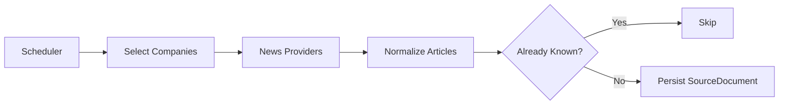
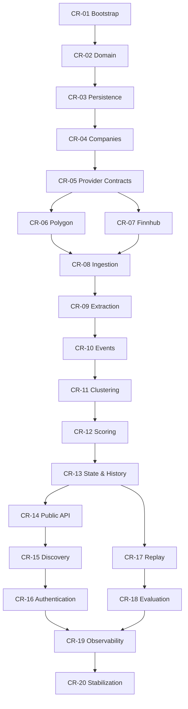

# CatalystRadar v0.1 Implementation Plan

## Purpose

This document defines the delivery plan for **CatalystRadar v0.1**.

It is a companion to:

- `docs/architecture.md`
- `docs/implementation-v0.1.md`
- `AGENTS.md`

The architecture document defines the system boundaries and design.
The implementation specification defines the expected v0.1 behavior.
This document defines **how the implementation must be delivered incrementally through small pull requests and atomic commits**.

When there is a conflict:

1. `docs/implementation-v0.1.md` defines the required v0.1 behavior.
2. `docs/architecture.md` defines architectural boundaries.
3. `AGENTS.md` defines coding and engineering rules.
4. This document defines sequencing and PR scope.

---

# Delivery principles

## One capability per PR

Each pull request should introduce one coherent capability that can be reviewed and demonstrated independently.

Avoid large PRs that combine unrelated concerns.

A typical PR should contain approximately:

- 3–8 meaningful commits;
- focused production code;
- tests covering the introduced behavior;
- documentation changes only when required by that PR.

## Atomic commits

Every commit should perform one conceptual change.

Prefer:

```text
feat(domain): add catalyst event types
test(domain): cover catalyst event validation
feat(db): persist catalyst events
test(db): verify catalyst event repository
```

Avoid:

```text
feat: implement everything
fix: fix tests
fix: more fixes
```

Where reasonably possible, each commit should compile and leave the test suite in a valid state.

## Scope discipline

Every PR must explicitly document:

- Goal
- Scope
- Out of scope
- Design notes
- API changes
- Database changes
- Tests
- Validation performed
- Follow-up work

Do not implement future PR scope early unless required to keep the current PR coherent.

## Review gate

After completing a PR:

1. run all required tests;
2. push every atomic commit to the PR branch;
3. open or update the pull request;
4. provide the PR URL and a concise summary;
5. **stop coding**;
6. ask for review;
7. continue to the next PR only after explicit approval.

Do not start the next PR while the current PR is waiting for review.

---

# Branch and PR naming

Use sequential CatalystRadar identifiers:

```text
CR-01
CR-02
CR-03
...
```

Suggested branch names:

```text
feat/cr-01-bootstrap
feat/cr-02-domain-model
feat/cr-03-persistence
feat/cr-08-news-ingestion
```

Suggested PR titles:

```text
[CR-01] Bootstrap Spring Boot application
[CR-02] Add core catalyst domain model
[CR-03] Add PostgreSQL persistence foundation
```

---

# Pull request plan

## PR 1 — Application skeleton and local runtime

### Goal

Create the minimal runnable CatalystRadar service and development environment.

### Scope

- Kotlin
- JVM 21
- Spring Boot
- Gradle Kotlin DSL
- application configuration
- local profile
- Docker Compose
- PostgreSQL with pgvector
- Spring Boot Actuator
- application context smoke test

### Out of scope

- domain model
- Flyway application schema
- external providers
- ingestion
- scoring

### Expected commits

```text
chore: initialize Spring Boot Kotlin application
chore: add PostgreSQL pgvector local environment
chore: add application configuration and profiles
chore: add actuator health endpoint
test: add application context smoke test
```

### Acceptance criteria

```bash
docker compose up -d
./gradlew clean test
./gradlew bootRun
```

The service must expose a healthy Actuator endpoint.

---

## PR 2 — Core domain model

### Goal

Implement the provider- and persistence-independent CatalystRadar domain.

### Scope

Add core types such as:

- `Company`
- `SourceDocument`
- `CatalystEvent`
- `EventCluster`
- `CatalystSnapshot`
- `EventFamily`
- `EventType`
- `Direction`
- `Directness`
- `SourceQuality`
- `EventHorizon`
- `CatalystState`
- `CatalystScore`
- `ScoreVelocity`

### Rules

Domain classes must not depend on:

- Spring
- JPA
- database annotations
- Polygon
- Finnhub
- OpenAI

### Expected commits

```text
feat(domain): add company domain model
feat(domain): add source document model
feat(domain): add catalyst event taxonomy
feat(domain): add catalyst state and score types
test(domain): cover domain invariants
```

---

## PR 3 — PostgreSQL persistence foundation

### Goal

Add the initial relational model and persistence adapters.

### Scope

- Flyway
- initial schema
- PostgreSQL persistence adapters
- Testcontainers
- repository integration tests

Initial tables:

```text
companies
source_documents
events
event_clusters
company_events
catalyst_snapshots
state_transitions
model_runs
ingestion_runs
```

Use pgvector where required by the v0.1 schema.

### Important decision

Prefer Spring Data JDBC unless implementation evidence strongly justifies another persistence approach.

### Expected commits

```text
feat(db): add initial Flyway schema
feat(db): add company persistence
feat(db): add source document persistence
feat(db): add event and cluster persistence
feat(db): add catalyst snapshot persistence
test(db): add PostgreSQL Testcontainers integration tests
```

---

## PR 4 — US company universe

### Goal

Provide a deterministic initial US equity universe and company lookup.

### Scope

Initial universe:

```text
S&P 500
+
Nasdaq-100
```

Deduplicate companies appearing in both indices.

Persist/reference:

- ticker
- company name
- exchange
- sector
- industry
- country
- active status
- aliases where available

A version-controlled seed resource is preferred for v0.1.

### API

```http
GET /v1/companies/{ticker}
```

### Expected commits

```text
feat(company): add company repository
feat(company): add US universe seed loader
feat(company): add ticker normalization
feat(company): add company lookup service
feat(api): expose company lookup endpoint
test(company): add universe and lookup tests
```

---

## PR 5 — Provider contracts

### Goal

Establish provider-independent interfaces before integrating third parties.

### Scope

Define stable contracts for:

```kotlin
interface NewsProvider
interface CompanyReferenceProvider
interface MarketDataProvider
interface EventExtractionProvider
```

Add provider-neutral DTOs such as:

- `NewsQuery`
- `RawArticle`
- `CompanyReference`
- `ExtractionRequest`
- `ExtractedEvent`

Add application-level provider errors.

### Expected commits

```text
feat(provider): define news provider contract
feat(provider): define reference data contract
feat(provider): define extraction provider contract
feat(provider): add provider error model
```

---

## PR 6 — Polygon adapter

### Goal

Implement the primary v0.1 external data adapter.

### Scope

Where supported:

- Polygon HTTP client
- news retrieval
- company/reference lookup

### Tests

Use WireMock or deterministic fixtures.

Do not call live Polygon APIs in normal CI.

### Expected commits

```text
feat(polygon): add Polygon HTTP client
feat(polygon): implement news provider adapter
feat(polygon): implement company reference adapter
test(polygon): add WireMock contract tests
```

---

## PR 7 — Finnhub adapter

### Goal

Implement Finnhub as secondary/fallback provider where useful.

### Scope

- Finnhub HTTP client
- news adapter
- reference adapter where required

### Expected commits

```text
feat(finnhub): add Finnhub HTTP client
feat(finnhub): implement news provider adapter
feat(finnhub): implement reference adapter
test(finnhub): add WireMock contract tests
```

---

## PR 8 — Source-document ingestion

### Goal

Build the first operational pipeline stage.

### Flow



### Scope

- ingestion-run tracking
- provider orchestration
- source-document normalization
- idempotency
- scheduled polling
- fallback behavior
- ingestion integration tests

### Idempotency

Prefer stable provider IDs.

Fallback to deterministic keys based on canonical article identity.

### Expected commits

```text
feat(ingestion): add ingestion run model
feat(ingestion): add source document deduplication
feat(ingestion): implement news ingestion service
feat(ingestion): add scheduled polling
feat(ingestion): add provider fallback policy
test(ingestion): add idempotency integration tests
```

---

## PR 9 — OpenAI event extraction

### Goal

Convert stored source documents into structured catalyst-event candidates.

### Scope

- extraction prompt v1
- structured output contract
- OpenAI adapter
- output validation
- model-run persistence
- token/latency/cost metadata
- golden extraction fixtures

Extracted attributes should include, where available:

```text
company
eventType
direction
confidence
magnitude
surprise
materiality
directness
horizon
evidence
```

### Expected commits

```text
feat(extraction): add extraction prompt v1
feat(openai): add OpenAI structured-output adapter
feat(extraction): validate extracted events
feat(extraction): persist model run metadata
test(extraction): add golden extraction fixtures
```

---

## PR 10 — Event normalization and persistence

### Goal

Convert extraction output into canonical internal CatalystRadar events.

### Scope

- company resolution
- taxonomy validation
- timestamp normalization
- source association
- event persistence

### Expected commits

```text
feat(event): add extracted-event normalization
feat(event): add company resolution
feat(event): persist catalyst events
feat(event): link events to source documents
test(event): add event normalization tests
```

---

## PR 11 — Event clustering and deduplication

### Goal

Prevent repeated reporting of the same real-world event from multiplying catalyst impact.

### Initial strategy

Candidate events may be considered related based on:

```text
same company
+
same event type
+
bounded time window
+
semantic similarity
```

Initial embedding baseline:

```text
text-embedding-3-small
1536 dimensions
```

The embedding choice is an implementation baseline, not a domain dependency.

### Expected commits

```text
feat(clustering): add canonical event cluster model
feat(clustering): add deterministic cluster candidates
feat(embedding): add embedding provider
feat(clustering): add vector similarity matching
feat(clustering): assign events to canonical clusters
test(clustering): cover duplicate article scenarios
```

---

## PR 12 — Catalyst score-v1

### Goal

Implement deterministic company catalyst scoring.

### Scope

Implement score-v1 using factors defined by the v0.1 specification, including:

- base event weight
- confidence
- source quality
- materiality
- surprise
- directness
- novelty
- event-specific time decay
- convergence bonus
- normalization to 0–100

### Rules

- scoring must not depend on LLM judgment beyond extracted attributes;
- score configuration must be centralized;
- persisted scores must record `score-v1`.

### Expected commits

```text
feat(scoring): add score-v1 configuration
feat(scoring): calculate event impact
feat(scoring): implement event-specific time decay
feat(scoring): add convergence bonus
feat(scoring): normalize company score to 0-100
test(scoring): cover score-v1 behavior
```

---

## PR 13 — Catalyst state, velocity, and snapshots

### Goal

Turn event scoring into temporal company intelligence.

### States

```text
NORMAL
WATCH
BUILDING
CATALYZED
HIGH
```

### Scope

- state derivation
- catalyst snapshots
- `velocity1d`
- `velocity3d`
- `velocity7d`
- state-transition persistence

### Expected commits

```text
feat(catalyst): derive catalyst state from score
feat(catalyst): persist catalyst snapshots
feat(catalyst): calculate score velocity
feat(catalyst): record state transitions
test(catalyst): cover state transition scenarios
```

---

## PR 14 — Public Catalyst API

### Goal

Expose company catalyst intelligence through versioned REST APIs.

### Endpoints

```http
GET /v1/companies/{ticker}
GET /v1/companies/{ticker}/events
GET /v1/companies/{ticker}/catalyst
GET /v1/companies/{ticker}/timeline
GET /v1/events
```

### Scope

- explicit API DTOs
- validation
- common error responses
- bounded pagination
- controller integration tests

### Expected commits

```text
feat(api): add common API error model
feat(api): expose company events
feat(api): expose catalyst state
feat(api): expose catalyst timeline
feat(api): expose event search
test(api): add controller integration tests
```

---

## PR 15 — Discovery API

### Goal

Expose the primary CatalystRadar discovery capability.

### Endpoint

```http
GET /v1/discovery/catalyzed
```

### Filters

At minimum:

```text
state
minScore
minVelocity7d
sector
limit
```

### Expected commits

```text
feat(discovery): add catalyst discovery query
feat(api): expose catalyzed discovery endpoint
feat(api): add discovery filtering and sorting
test(discovery): add discovery integration tests
```

### Functional v0.1 milestone

After PR 15, CatalystRadar should be capable of:

```text
real news
    ↓
SourceDocument
    ↓
structured event
    ↓
canonical cluster
    ↓
CatalystScore
    ↓
CatalystSnapshot
    ↓
discovery API
```

This is the first end-to-end usable product milestone.

---

# Hardening and validation PRs

## PR 16 — API-key authentication

### Scope

- API-client persistence
- API-key generation
- raw key shown only on creation
- stored key hashes
- authentication filter/security config
- public health endpoint exemption

### Expected commits

```text
feat(security): add API client persistence
feat(security): add API key generation and hashing
feat(security): authenticate public API requests
feat(security): exclude health endpoints
test(security): add API authentication tests
```

---

## PR 17 — Historical replay

### Goal

Support deterministic reprocessing of stored source documents.

### Scope

Introduce a replay-run concept carrying:

```text
taxonomyVersion
extractorVersion
scoreVersion
cutoff
```

Historical replays must never use documents unavailable before the replay cutoff.

### Expected commits

```text
feat(replay): add replay run model
feat(replay): add point-in-time document selection
feat(replay): reprocess extraction pipeline
feat(replay): recalculate catalyst snapshots
test(replay): verify no look-ahead data is used
```

---

## PR 18 — Evaluation framework

### Goal

Measure whether catalyst accumulation provides useful forward information.

### Scope

- positive benchmark cases
- matched controls
- Polygon historical prices
- forward returns
- precision
- recall
- false-positive rate
- lead time
- MFE
- MAE
- coverage

### Expected commits

```text
feat(evaluation): add benchmark case model
feat(evaluation): add matched control support
feat(evaluation): calculate forward returns
feat(evaluation): calculate detection metrics
feat(evaluation): generate benchmark report
test(evaluation): add deterministic benchmark fixtures
```

---

## PR 19 — Observability hardening

### Goal

Make pipeline behavior and external costs observable.

### Metrics

Examples:

```text
news.fetch.count
news.fetch.errors
news.fetch.latency

llm.requests
llm.tokens.input
llm.tokens.output
llm.cost

documents.ingested
events.extracted
events.clustered

catalyst.state.transitions
```

### Expected commits

```text
feat(observability): add provider metrics
feat(observability): add extraction cost metrics
feat(observability): add pipeline metrics
feat(observability): improve structured logging
```

---

## PR 20 — v0.1 stabilization

### Goal

Finalize v0.1 without introducing new architecture.

### Scope

- end-to-end integration test
- API consistency
- runtime configuration review
- documentation
- issue cleanup
- acceptance testing

### Acceptance scenario

Given real or representative news for a known US company:

```text
SourceDocument stored
Event extracted
Event normalized
Event clustered
Catalyst score updated
Snapshot persisted
Company returned by relevant API/discovery queries
```

### Expected commits

```text
test(e2e): add full catalyst pipeline test
fix: resolve v0.1 integration issues
docs: finalize API and local development docs
chore: finalize v0.1 configuration defaults
```

---

# Dependency overview



---

# PR template

Each pull request should include:

```md
## Goal

What capability this PR introduces.

## Scope

- ...
- ...

## Out of scope

- ...
- ...

## Design

Short explanation of the implementation.

## API changes

None, or list the changed endpoints/contracts.

## Database changes

None, or list the Flyway migrations.

## Tests

- unit
- integration
- provider fixtures
- golden dataset where relevant

## Validation

Commands actually run:

```bash
./gradlew clean test
```

Add any additional commands that were really executed.

## Follow-up

What intentionally belongs to the next PR.
```

---

# Agent execution protocol

For every PR:

1. Read:
   - `AGENTS.md`
   - `docs/architecture.md`
   - `docs/implementation-v0.1.md`
   - this implementation plan.

2. Inspect the current codebase before modifying it.

3. Create or switch to the branch defined for the current PR.

4. Implement **only** the current PR scope.

5. Create atomic commits continuously while implementing.
   Do not wait until the end to produce one large commit.

6. Add or update tests together with each behavior.

7. Run the relevant test suite.

8. Before completing the PR run:

```bash
./gradlew clean test
```

9. Push all commits to the remote branch.

10. Open or update the pull request.

11. Report:
    - PR URL
    - commits pushed
    - what changed
    - tests executed and results
    - any deliberate deviations from the plan
    - any known limitations

12. **STOP.**

13. Ask the user to review the PR.

14. Do not start, branch, or implement the next PR until the user explicitly approves continuing.

If review feedback is provided:

1. apply the feedback on the same PR branch;
2. make additional atomic commits;
3. run tests again;
4. push;
5. report the update;
6. stop again for review.

---

# Definition of v0.1 complete

CatalystRadar v0.1 is complete when:

- PRs CR-01 through CR-20 are merged or explicitly waived;
- the pipeline works end-to-end;
- point-in-time replay is supported;
- the discovery API returns catalyst intelligence;
- deterministic score-v1 is versioned and tested;
- provider integrations are isolated behind adapters;
- tests pass from a clean environment;
- Flyway migrations work against a fresh PostgreSQL database;
- no v0.2-only infrastructure has been introduced without an ADR/explicit decision.
