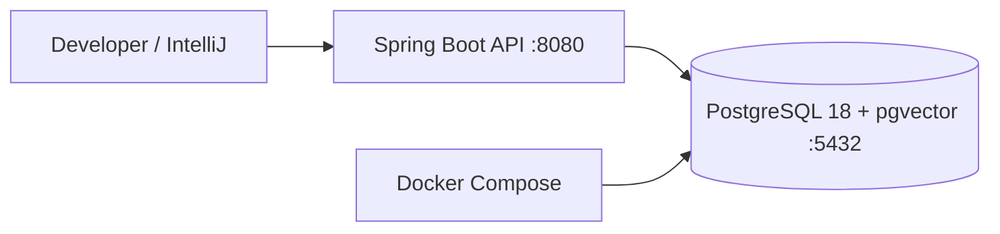
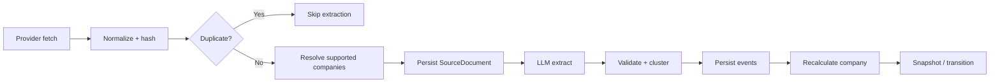

# CatalystRadar v0.1 — Implementation Specification & Agent Handoff

_Status: design baseline — September 2026_

> **Implementation objective:**Deliver a working local/CI-ready CatalystRadar v0.1 application. Repo creation is explicitly out of scope. The agent should implement inside an already prepared project directory or supplied repository.


# 1. Definition of done

- Kotlin/JDK 21 Spring Boot application builds and starts locally.

- docker compose up -d starts PostgreSQL 18 + pgvector; no Redis/Kafka is required.

- Flyway creates the v0.1 schema from an empty database.

- US company universe can be seeded/refreshed through a provider-neutral application service.

- Polygon and Finnhub adapters normalize news/data into SourceDocument.

- OpenAI adapter produces strict structured event candidates and embeddings.

- Documents are idempotently persisted and duplicate LLM processing is avoided.

- Events are validated, clustered/deduplicated and persisted with model provenance.

- score-v1 recomputes affected company state, snapshot and transition deterministically.

- Public v1 API and OpenAPI expose company, event, catalyst, timeline and discovery data.

- Testcontainers integration tests cover migrations, persistence and the end-to-end vertical slice.

- Golden extraction fixtures exist for event taxonomy regression tests.

- No UI, repo creation, deployment, SEC/IR ingestion, webhooks, Redis, Kafka or trading logic is introduced.

# 2. Fixed implementation decisions

| **Decision**                 | **v0.1 value**                                   |
|------------------------------|--------------------------------------------------|
| Project/product name         | CatalystRadar                                    |
| Language                     | Kotlin                                           |
| JVM                          | JDK 21                                           |
| Framework                    | Spring Boot 4.1.x                                |
| Build                        | Gradle Kotlin DSL                                |
| Market scope                 | US equities only                                 |
| Primary datastore            | PostgreSQL 18 + pgvector                         |
| Migrations                   | Flyway                                           |
| LLM extraction               | OpenAI Structured Outputs through adapter        |
| Embeddings                   | text-embedding-3-small; 1536 dimensions          |
| News/reference providers     | Polygon primary; Finnhub secondary/fallback      |
| Market prices for evaluation | Polygon                                          |
| Runtime topology             | Single Spring Boot deployable / modular monolith |
| API                          | REST / JSON / OpenAPI                            |
| UI                           | Out of scope                                     |
| Auth                         | API keys; dev bypass allowed for public API      |
| Async infrastructure         | Spring scheduler + coroutines; no external queue |
| Primary sources              | Deferred to v0.2                                 |

# 3. Recommended package structure

```text
com.catalystradar

├── CatalystRadarApplication.kt

├── api

│ ├── publicapi

│ ├── internal

│ ├── dto

│ └── error

├── application

│ ├── ingestion

│ ├── extraction

│ ├── scoring

│ ├── discovery

│ └── company

├── domain

│ ├── company

│ ├── event

│ ├── catalyst

│ └── common

├── ports

│ ├── NewsProvider.kt

│ ├── CompanyReferenceProvider.kt

│ ├── MarketDataProvider.kt

│ ├── EventExtractionProvider.kt

│ └── EmbeddingProvider.kt

├── adapters

│ ├── polygon

│ ├── finnhub

│ └── openai

├── persistence

│ ├── company

│ ├── document

│ ├── event

│ ├── catalyst

│ └── jooq-or-jdbc

├── scheduling

├── security

├── config

└── observability
```

| **Dependency rule** domain has no Spring, HTTP client, provider SDK or database DTO dependency. application depends on domain + ports. adapters/persistence implement ports. api calls application services. |
|--------------------------------------------------------------------------------------------------------------------------------------------------------------------------------------------------------------|

# 4. Gradle dependencies

Use Spring dependency management. Pin exact plugin/runtime versions in the project; do not use dynamic + versions.

```kotlin
implementation("org.springframework.boot:spring-boot-starter-web")

implementation("org.springframework.boot:spring-boot-starter-validation")

implementation("org.springframework.boot:spring-boot-starter-actuator")

implementation("org.springframework.boot:spring-boot-starter-security")

implementation("org.springframework.boot:spring-boot-starter-jdbc")

implementation("org.flywaydb:flyway-core")

implementation("org.postgresql:postgresql")

implementation("org.jetbrains.kotlinx:kotlinx-coroutines-core")

implementation("com.fasterxml.jackson.module:jackson-module-kotlin")

implementation("org.springdoc:springdoc-openapi-starter-webmvc-ui:<compatible-version>")

testImplementation("org.springframework.boot:spring-boot-starter-test")

testImplementation("org.testcontainers:postgresql")

testImplementation("org.testcontainers:junit-jupiter")

testImplementation("org.wiremock:wiremock:<pinned-version>")
```

Avoid provider-specific Java SDKs in the first vertical slice unless they clearly reduce code. Plain Spring RestClient/WebClient adapters keep request/response handling transparent and easy to stub with WireMock.

# 5. Local Docker environment




```yaml
services:
  postgres:
    image: pgvector/pgvector:pg18
    environment:
      POSTGRES_DB: catalyst_radar
      POSTGRES_USER: catalyst
      POSTGRES_PASSWORD: catalyst
    ports:
      - "5432:5432"
    healthcheck:
      test: ["CMD-SHELL", "pg_isready -U catalyst -d catalyst_radar"]
      interval: 5s
      timeout: 3s
      retries: 10
    volumes:
      - catalyst_pgdata:/var/lib/postgresql/data

volumes:
  catalyst_pgdata:
```

Application runs outside Docker in development. Add a production Dockerfile only if useful to CI/deployment later; it is not required for the first coding slice.

# 6. Configuration contract

```bash
CATALYST_DB_URL=jdbc:postgresql://localhost:5432/catalyst_radar
CATALYST_DB_USER=catalyst
CATALYST_DB_PASSWORD=catalyst
POLYGON_API_KEY=...
FINNHUB_API_KEY=...
OPENAI_API_KEY=...
CATALYST_NEWS_PROVIDER=polygon
CATALYST_NEWS_FALLBACK_PROVIDER=finnhub
CATALYST_INGESTION_ENABLED=true
CATALYST_INGESTION_INTERVAL=PT30M
CATALYST_LOOKBACK=PT2H
CATALYST_OPENAI_EXTRACTION_MODEL=<configured-model>
CATALYST_OPENAI_EMBEDDING_MODEL=text-embedding-3-small
CATALYST_EXTRACTION_PROMPT_VERSION=event-extractor-v1
CATALYST_TAXONOMY_VERSION=taxonomy-v1
CATALYST_SCORE_VERSION=score-v1
CATALYST_API_AUTH_ENABLED=false
CATALYST_INTERNAL_ADMIN_KEY=local-dev-secret
```

Do not commit real secrets. application.yml contains defaults/non-secrets; application-local.yml or environment variables supply developer credentials.

# 7. Ports to implement

```kotlin
interface NewsProvider {
suspend fun fetch(request: NewsFetchRequest): NewsFetchResult
}
interface CompanyReferenceProvider {
suspend fun listUsEquities(cursor: String? = null): CompanyPage
}
interface MarketDataProvider {
suspend fun dailyBars(ticker: String, from: LocalDate, to: LocalDate): List<DailyBar>
}
interface EventExtractionProvider {
suspend fun extract(document: SourceDocument, companies: List<Company>): ExtractionResult
}
interface EmbeddingProvider {
suspend fun embed(text: String): Embedding
}
```

Every adapter must map provider errors to a small internal error hierarchy such as RateLimited, AuthenticationFailed, TemporaryUnavailable, InvalidResponse and PermanentFailure.

# 8. Provider responsibilities

| **Adapter** | **Implement now**                                                                                     | **Do not implement now**                                     |
|-------------|-------------------------------------------------------------------------------------------------------|--------------------------------------------------------------|
| Polygon     | US ticker/reference sync; news fetch; daily OHLC bars for evaluation; pagination/rate-limit handling. | Streaming ticks/options/technical indicators.                |
| Finnhub     | Company news fallback/secondary source; optional earnings calendar context.                           | Broad primary-source ingestion or analyst research scraping. |
| OpenAI      | Strict event extraction; embedding generation; model/token/latency tracking.                          | Scoring/state decisions or autonomous agent loops.           |

News fetching should support provider-specific cursors/time windows but return the common NewsFetchResult. Store provider and provider_document_id so the same provider item is cheaply rejected on subsequent runs.

# 9. SourceDocument ingestion




1.  Create IngestionRun(status=RUNNING).

2.  Fetch provider page/window.

3.  Normalize to SourceDocumentCandidate.

4.  Compute normalized content hash (SHA-256 over stable title/body/url representation).

5.  If provider/document id or content hash already exists: increment duplicate_count and skip extraction.

6.  Resolve one or more supported companies from provider tickers and aliases.

7.  Persist SourceDocument, including raw_payload JSONB and discovered_at.

8.  Invoke extraction only when at least one supported company is resolved.

9.  Persist model run + events/clusters; recalculate each affected company.

10. Update ingestion cursor and counters transactionally where practical.

11. Mark run SUCCESS/PARTIAL/FAILED with error summary.

# 10. Company universe

v0.1 is US equities only. Keep the universe explicit and queryable rather than assuming every symbol returned by a news provider is supported.

- Seed with the union of S&P 500 and Nasdaq-100 constituents, deduplicated by ticker/exchange. This is a practical development universe, not a product limitation.

- Persist company aliases: ticker, legal name, common short name and provider-known names where available.

- Provide an internal sync service that can later expand to all liquid US common stocks without changing the domain/API.

- Exclude ETFs, funds, warrants, preferreds, OTC/penny instruments and inactive tickers from the initial universe.

# 11. Event extraction schema

Define a JSON Schema owned by the application, not by the provider. The OpenAI response represents candidates, which Kotlin validates before creating domain events.

```text
ExtractionResult {

document_relevant: boolean,

events: [

{

ticker: string,

family: EventFamily,

type: EventType,

direction: POSITIVE|NEGATIVE|NEUTRAL|MIXED,

confidence: number 0..1,

magnitude: number|null,

surprise: number|null 0..1,

materiality: number|null 0..1,

expected_horizon: INTRADAY|DAYS|WEEKS|MONTHS|STRUCTURAL,

directness: DIRECT|INFERRED,

event_timestamp: RFC3339|null,

evidence: [{ quote_or_fact: string, source_offset_hint: string|null }],

attributes: object

}

]

}
```

Do not ask the model for final catalyst score, state, buy/sell language or price prediction. If the source does not support an event, events must be empty.

# 12. taxonomy-v1 implementation

Implement strongly typed enums for the 11 families and the agreed event types. Event attributes remain JSONB/Map<String,String> so family-specific fields can evolve without schema churn. Taxonomy version is persisted with every event.

| **Mandatory first coverage** At minimum, tests must cover earnings/revenue beat-miss, guidance raise-cut, backlog/bookings changes, contract/order/customer changes, takeover/acquisition, buyback, analyst upgrade/downgrade, regulatory approval/denial, legal win/loss, CEO departure, insider buy, index inclusion/exclusion and external read-through events. |
|--------------------------------------------------------------------------------------------------------------------------------------------------------------------------------------------------------------------------------------------------------------------------------------------------------------------------------------------------------------------|

# 13. Deduplication algorithm v0.1

12. Exact document duplicate: unique content_hash and provider/provider_document_id checks.

13. For each validated candidate, search recent clusters for the same company + event type within 72 hours.

14. Build normalized cluster text from ticker + type + canonical factual summary.

15. Embed normalized cluster text.

16. Compute cosine similarity against candidate clusters.

17. If similarity >= configured threshold, attach event/evidence to that cluster and ensure only one canonical scoring contribution is counted.

18. Otherwise create a new cluster and use its first event as canonical contribution.

```yaml
catalyst.dedup:

window: PT72H

similarity-threshold: 0.86 # initial calibration value, config not constant

max-candidates: 25
```

If no pgvector index is needed for the small initial universe, do not prematurely add HNSW/IVFFlat. A filtered recent-cluster query plus exact cosine ordering is sufficient. Add an ANN index only after measuring need.

# 14. Persistence / Flyway


Implement a first migration equivalent to the approved schema: companies, company_aliases, source_documents, model_runs, event_clusters, events, ingestion_runs, catalyst_snapshots, state_transitions, api_clients and score_versions. Enable vector and pgcrypto extensions.

| **Schema refinement** Keep VECTOR(1536) for v0.1 because the chosen embedding model is text-embedding-3-small. Add embedding_model and embedding_version columns (or equivalent metadata) to source_documents/event_clusters before treating the migration as final. |
|----------------------------------------------------------------------------------------------------------------------------------------------------------------------------------------------------------------------------------------------------------------------|

Use UUID primary keys and timestamptz. Store all timestamps in UTC. Use JSONB for raw_payload, event attributes and score configuration. Unique constraints are part of idempotency, not just integrity.

# 15. score-v1 implementation

The score engine should operate on domain objects and a versioned ScoreConfig loaded from score_versions/config (with an application default inserted by migration or bootstrap). Do not scatter weights across code.

```kotlin
data class ScoreConfig(

val version: String,

val baseWeights: Map<EventType, Double>,

val sourceQualityFactors: Map<SourceQuality, Double>,

val horizonHalfLivesDays: Map<EventType, Double>,

val directnessFactors: Map<Directness, Double>,

val convergenceMultipliers: Map<Int, Double>,

val stateThresholds: StateThresholds

)

rawContribution(event, asOf) =

baseWeight(type)

* directionSign(direction)

* confidence

* factor(materiality ?: 1.0)

* factor(surprise ?: 1.0)

* sourceQualityFactor

* directnessFactor

* decay(type, age)

rawScore = sum(canonicalActiveEvents) * convergenceBonus

score = normalize(rawScore).coerceIn(0.0, 100.0)
```

Define initial weights in JSON/YAML from the design rather than claiming they are calibrated. All scoring tests should use a fixed clock.

# 16. State / snapshot behavior


| **State** | **Initial range**    |
|-----------|----------------------|
| NORMAL    | 0 <= score < 25    |
| WATCH     | 25 <= score < 45   |
| BUILDING  | 45 <= score < 65   |
| CATALYZED | 65 <= score < 80   |
| HIGH      | 80 <= score <= 100 |

After an event changes a company score, persist a snapshot if score changed materially or state changed. Also provide a daily snapshot job so velocity lookbacks remain queryable even on quiet days. Persist an explicit StateTransition whenever state changes.

```text
velocity1d = current.score - latestSnapshotAtOrBefore(now - 1d).score

velocity3d = current.score - latestSnapshotAtOrBefore(now - 3d).score

velocity7d = current.score - latestSnapshotAtOrBefore(now - 7d).score
```

# 17. API contract

| **Method / path**                             | **Minimum response**                                                                                                             |
|-----------------------------------------------|----------------------------------------------------------------------------------------------------------------------------------|
| GET /v1/companies/{ticker}                    | ticker, name, exchange, sector, industry, active                                                                                 |
| GET /v1/companies/{ticker}/events             | event id/type/family/direction, timestamps, confidence, canonical cluster, source summary, versions                              |
| GET /v1/companies/{ticker}/catalyst           | score/state, positive/negative/direct/inferred scores, velocity 1/3/7d, event counts, top drivers, score/taxonomy versions, asOf |
| GET /v1/companies/{ticker}/timeline           | ordered snapshots + state transitions; from/to/limit filters                                                                     |
| GET /v1/events                                | filters: ticker/family/type/direction/from/to; paginated                                                                         |
| GET /v1/discovery/catalyzed                   | filters: states, minScore, minVelocity7d, sector, limit/offset or cursor; sorted by score/velocity option                        |
| POST /internal/ingestion/run                  | trigger selected provider; return run id/status                                                                                  |
| POST /internal/companies/{ticker}/recalculate | recompute with active score version; return snapshot                                                                             |

Use controller DTOs separate from persistence records. Never return raw_payload, API keys, provider auth errors or full source bodies from public endpoints.

# 18. API authentication

Implement a lightweight bearer API-key filter when catalyst.api.auth-enabled=true. Persist only a hash and a short prefix. Internal endpoints always require CATALYST_INTERNAL_ADMIN_KEY even in local development unless tests explicitly override security.

```text
Authorization: Bearer cr_live_<secret>

lookup:

prefix -> candidate api_clients

constant-time compare hash(secret) with stored hash

reject disabled key

update last_used_at asynchronously/best-effort
```

# 19. Scheduler behavior

Use one Spring scheduled coordinator. The default dev interval is 30 minutes and is configurable. Prevent overlapping runs with a PostgreSQL advisory lock or a small DB-backed lock; do not introduce Redis solely for this.

- Use a configurable lookback overlap (default 2h) to tolerate provider delays; idempotency makes overlap safe.

- Provider rate-limit errors should end the run as PARTIAL and preserve the last successful cursor/window.

- A single document failure should not abort all subsequent documents in a page.

- Retries: bounded exponential backoff for transient 429/5xx/network errors; no retry on auth/validation failures.

# 20. Transactions

- Persist SourceDocument idempotently in a short DB transaction.

- Do external LLM/embedding calls outside an open DB transaction.

- Persist model run + validated events/clusters atomically when feasible.

- Re-score a company transactionally with snapshot/transition persistence, using row/advisory locking to avoid two concurrent recalculations for the same company.

# 21. Observability

Use Actuator + Micrometer from day one. Structured logs should include runId, provider, documentId, company/ticker and modelRunId where applicable.

| **Metric**                                          | **Type**                                                 |
|-----------------------------------------------------|----------------------------------------------------------|
| catalyst_ingestion_documents_total{provider,status} | counter                                                  |
| catalyst_ingestion_run_duration_seconds{provider}   | timer                                                    |
| catalyst_llm_calls_total{operation,status}          | counter                                                  |
| catalyst_llm_tokens_total{model,direction}          | counter                                                  |
| catalyst_llm_latency_seconds{operation,model}       | timer                                                    |
| catalyst_events_total{family,type,direction}        | counter                                                  |
| catalyst_state_transitions_total{from,to}           | counter                                                  |
| catalyst_company_score                              | do NOT emit per-company metric in v0.1; high-cardinality |

# 22. Testing strategy

| **Layer**               | **Required coverage**                                                                                                             |
|-------------------------|-----------------------------------------------------------------------------------------------------------------------------------|
| Unit                    | Taxonomy parsing, score contribution, decay, convergence, normalization, state thresholds, hash normalization, provider mappings. |
| Adapter contract        | WireMock fixtures for Polygon/Finnhub/OpenAI success, pagination, 429, malformed response and auth failure.                       |
| Persistence             | Testcontainers PostgreSQL+pgvector; migrations, uniqueness/idempotency, vector round-trip, snapshot queries.                      |
| Application integration | Document -> extraction candidate -> cluster -> event -> score -> snapshot -> API response.                                  |
| Golden extraction       | 50+ curated article/source fixtures over time; first commit may start smaller but infrastructure must exist.                      |
| Replay                  | Same input + same taxonomy/score/extractor fixture produces deterministic canonical scoring result.                               |

| **Critical test** Two differently worded provider documents describing the same guidance raise must create one scoring cluster, preserve both evidence records, and not double the company score. |
|---------------------------------------------------------------------------------------------------------------------------------------------------------------------------------------------------|

# 23. Historical evaluation hooks

Do not build a full research UI. Build just enough application/service support so a later CLI/test harness can replay documents with an asOf cutoff and query score snapshots. Polygon daily bars are used to calculate forward returns outside score-v1.

- All evaluation queries accept an explicit asOf/cutoff.

- No document with published_at/discovered_at after cutoff may participate.

- Store scoreVersion, taxonomyVersion and extractorVersion for reproducibility.

- Benchmark definitions live as data fixtures (CSV/JSON), while fetched raw documents remain in database/object storage, not source control.

# 24. Error response standard

```json
{
"type": "https://catalystradar.dev/problems/company-not-found",
"title": "Company not found",
"status": 404,
"code": "COMPANY_NOT_FOUND",
"detail": "No supported company exists for ticker XYZ",
"requestId": "..."
}
```

Map validation to 400, missing resources to 404, auth to 401/403, rate limits to 429 when applicable, and unexpected server errors to 500 without leaking provider secrets.

# 25. Suggested implementation sequence

19. Bootstrap Spring application configuration, Actuator, Jackson/Kotlin, validation and OpenAPI.

20. Add Docker Compose + Testcontainers PostgreSQL/pgvector and Flyway V1 migration.

21. Implement domain enums/data classes and persistence repositories for company/document/run.

22. Implement Polygon CompanyReferenceProvider and company universe sync/seed.

23. Implement Polygon NewsProvider plus normalized SourceDocument ingestion/idempotency.

24. Implement OpenAI EventExtractionProvider Structured Output contract and model_runs tracking.

25. Implement EmbeddingProvider and event clustering/deduplication.

26. Implement taxonomy-v1 validation and event persistence.

27. Implement score-v1, snapshots, velocity and state transitions.

28. Implement public company/event/catalyst/timeline/discovery endpoints.

29. Implement API-key/internal endpoint security.

30. Add Finnhub news fallback adapter and provider contract tests.

31. Add golden extraction fixtures and complete end-to-end vertical-slice tests.

32. Add replay/evaluation service hooks and Polygon daily-bar adapter tests.

# 26. Agent guardrails

- Do not create or rename a Git repository.

- Do not add a UI.

- Do not add Redis, Kafka, RabbitMQ, Elasticsearch, Qdrant/Pinecone/Weaviate or Kubernetes.

- Do not add SEC/IR scraping in v0.1.

- Do not add buy/sell/entry/stop/position-sizing logic.

- Do not let LLM output directly mutate catalyst score/state without validation and deterministic recomputation.

- Do not couple domain types to Polygon, Finnhub, OpenAI, Spring MVC or JDBC DTOs.

- Do not optimize vectors with ANN indexes before profiling.

- Do not silently change taxonomy-v1 or score-v1; version every change.

- Prefer the simplest implementation that preserves replayability, idempotency and testability.

# 27. Open items that do not block the first vertical slice

| **Item**                | **Current handling**                                                                                      |
|-------------------------|-----------------------------------------------------------------------------------------------------------|
| Exact extraction model  | Configuration value; choose a current Structured Outputs-capable model at implementation time and pin it. |
| Final score weights     | Seed score-v1 with design defaults; calibration follows historical benchmark.                             |
| Similarity threshold    | Start 0.86 configurable; tune using duplicate/non-duplicate fixtures.                                     |
| Full liquid-US universe | Start S&P 500 + Nasdaq-100; expansion is a later data decision.                                           |
| Webhooks/notifications  | v0.2. v0.1 clients poll discovery API.                                                                    |
| Primary-source quality  | v0.2 SEC/IR connectors.                                                                                   |
| CatalystGap             | Not in v0.1 scoring; market prices exist only for evaluation.                                             |
| Deployment target       | Intentionally unspecified.                                                                                |

# 28. Final acceptance scenario

The implementation should demonstrate the following deterministic flow in an integration test or reproducible local script:

Given:

a supported US company DELL

document A describing a guidance raise

document B from another provider describing the same guidance raise

When:

both documents are ingested

Then:

both SourceDocuments are preserved

extraction creates validated GUIDANCE_RAISE candidates

both candidates resolve to one canonical EventCluster

the cluster contributes once to score-v1

a CatalystSnapshot is persisted

any state change is persisted as StateTransition

GET /v1/companies/DELL/catalyst returns the updated state

GET /v1/companies/DELL/events exposes the canonical event/evidence

GET /v1/discovery/catalyzed reflects DELL if configured thresholds are crossed
